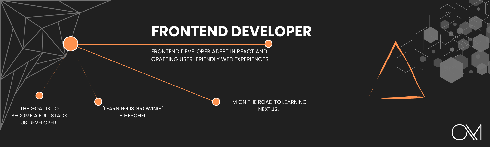

<h1 align="center">
 <a href="https://git.io/typing-svg>
<h3 align="center">A passionate fullstack developer from Paris</h3>

  

- 🔭 I’m currently studing on [THP](https://www.thehackingproject.org/)

- 🌱 I’m currently learning **React**

- 📫 How to reach me **Olivier-maria@hotmail.com**

<h3 align="left">Connect with me:</h3>

<h3 align="left">Languages and Tools:</h3>

            

# 📊 GitHub Stats:

    

    

    

