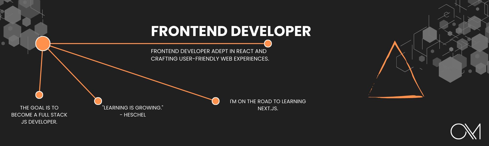

 

  
  
  
  

 

<h1 align="left">
  
</h1>

  

    I'm a Frontend web developer from Paris, looking for an opportunity to apply my skills in creating user interfaces. I'm passionate about web design and performance optimization, and I aim to contribute to practical projects. Open to new collaborations, I'm eager to further develop my Frontend development skills.
  

 

  

<h2>🚀 Streak Stats</h2>

  
  

<h2>🤝 Contributions</h2>

 

